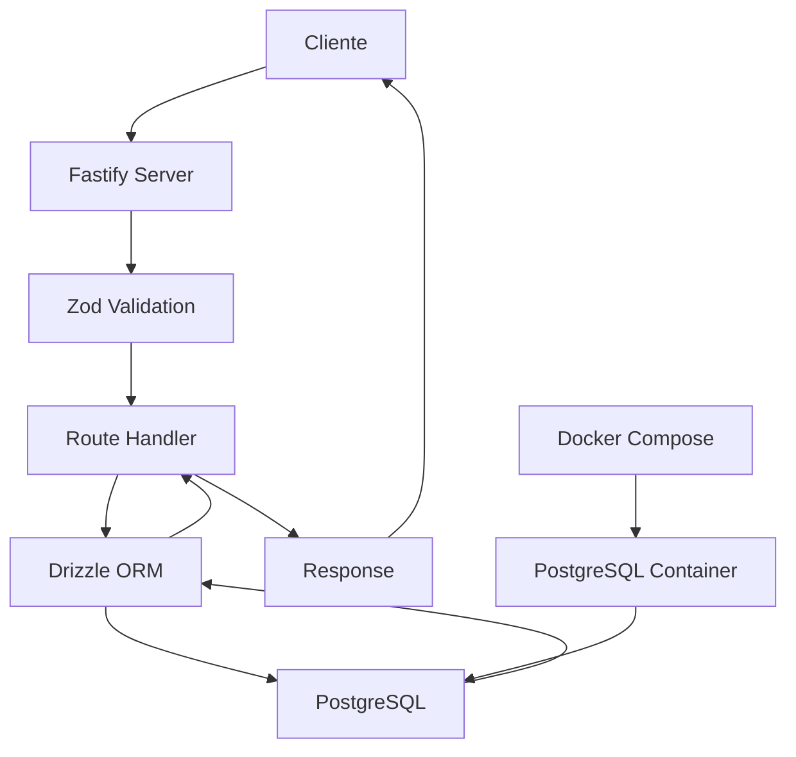
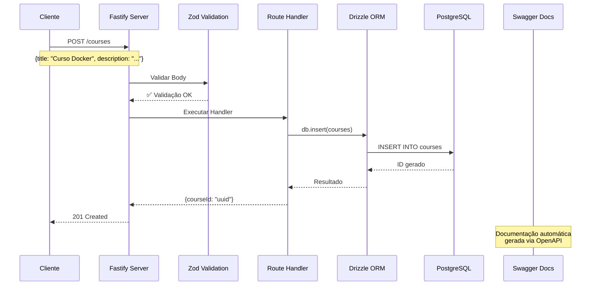
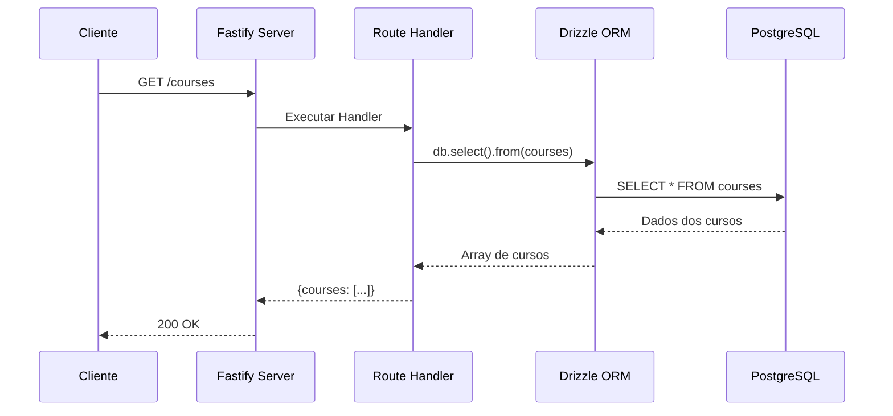
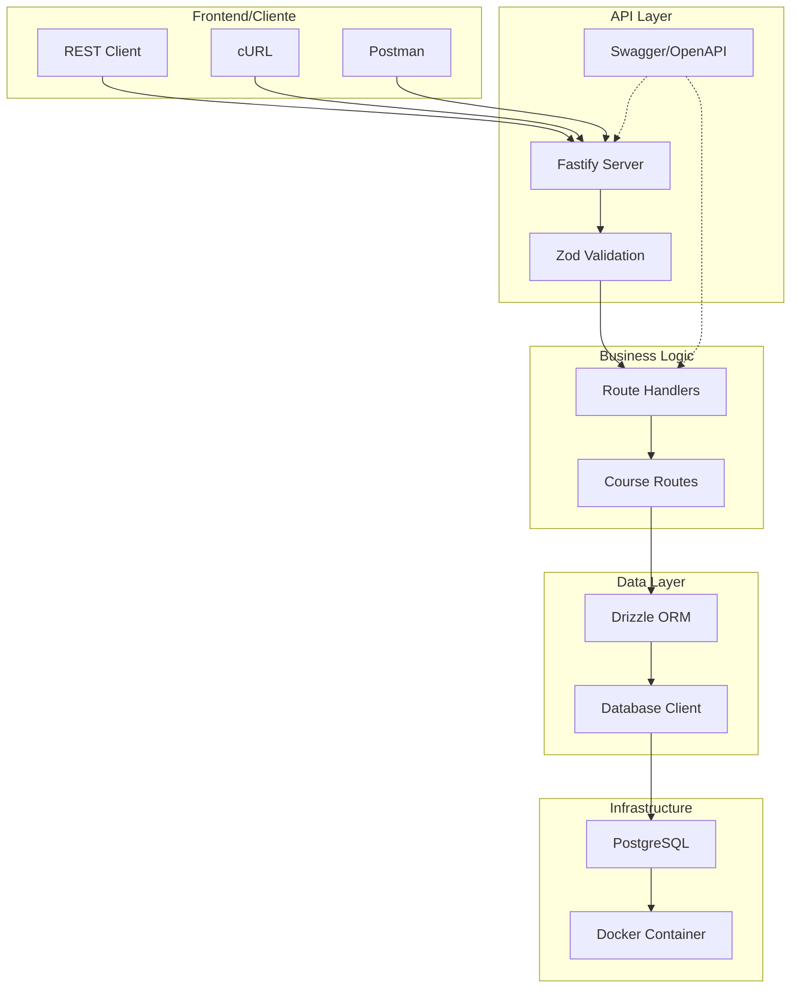

# 🚀 API de Cursos - Node.js com Fastify

Uma API REST moderna construída com Node.js, Fastify, TypeScript e PostgreSQL, utilizando Drizzle ORM para gerenciamento de banco de dados.

## 📋 Descrição

Este projeto é uma API para gerenciamento de cursos, desenvolvida como parte do desafio da Rocketseat. A aplicação demonstra boas práticas de desenvolvimento com TypeScript, validação de dados com Zod, documentação automática com Swagger/OpenAPI e gerenciamento de banco de dados com Drizzle ORM.

## 🛠️ Tecnologias Utilizadas

- **Node.js** - Runtime JavaScript
- **TypeScript** - Linguagem de programação tipada
- **Fastify** - Framework web rápido e eficiente
- **Drizzle ORM** - ORM moderno para TypeScript
- **PostgreSQL** - Banco de dados relacional
- **Docker** - Containerização
- **Zod** - Validação de esquemas
- **Swagger/OpenAPI** - Documentação da API
- **Pino Pretty** - Logs formatados

## 🚀 Como Executar

### Pré-requisitos

- Node.js 18+
- Docker e Docker Compose
- npm ou yarn

### Instalação

1. **Clone o repositório**
```bash
git clone <url-do-repositorio>
cd aulas
```

2. **Instale as dependências**
```bash
npm install
```

3. **Configure as variáveis de ambiente**
```bash
cp .env.example .env
# Edite o arquivo .env com suas configurações
```

4. **Suba o banco de dados com Docker**
```bash
docker compose up -d
```

5. **Execute as migrações**
```bash
npm run db:migrate
```

6. **Inicie o servidor de desenvolvimento**
```bash
npm run dev
```

O servidor estará rodando em `http://localhost:3333`

## 📚 Documentação da API

A documentação da API está disponível em:
- **Swagger UI**: `http://localhost:3333/docs` (apenas em desenvolvimento)
- **Scalar API Reference**: Interface mais moderna e bonita

## 🗄️ Banco de Dados

### Estrutura das Tabelas

#### Tabela `users`
- `id` (UUID, Primary Key)
- `name` (Text, Not Null)
- `email` (Text, Not Null, Unique)

#### Tabela `courses`
- `id` (UUID, Primary Key)
- `title` (Text, Not Null, Unique)
- `description` (Text, Optional)

### Comandos do Drizzle

```bash
# Gerar SQL baseado no schema
npm run db:generate

# Executar migrações
npm run db:migrate

# Abrir o Drizzle Studio
npm run db:studio
```

## 📁 Estrutura do Projeto

```
├── src/
│   ├── database/
│   │   ├── client.ts      # Configuração do cliente Drizzle
│   │   └── schema.ts      # Definição das tabelas
│   └── routes/
│       ├── create-course.ts
│       ├── get-courses.ts
│       └── get-course-by-id.ts
├── drizzle/               # Arquivos de migração gerados
├── server.ts             # Arquivo principal do servidor
├── drizzle.config.ts     # Configuração do Drizzle
├── docker-compose.yml    # Configuração do Docker
└── requests.http         # Exemplos de requisições
```

## 🔧 Scripts Disponíveis

- `npm run dev` - Inicia o servidor em modo desenvolvimento
- `npm run db:generate` - Gera arquivos de migração
- `npm run db:migrate` - Executa migrações pendentes
- `npm run db:studio` - Abre o Drizzle Studio

## 📡 Endpoints da API

### Cursos

- `POST /courses` - Criar um novo curso
- `GET /courses` - Listar todos os cursos
- `GET /courses/:id` - Buscar curso por ID

### Exemplo de Uso

```bash
# Criar um curso
curl -X POST http://localhost:3333/courses \
  -H "Content-Type: application/json" \
  -d '{"title": "Curso de Docker", "description": "Aprenda Docker do zero"}'

# Listar cursos
curl http://localhost:3333/courses

# Buscar curso específico
curl http://localhost:3333/courses/{id}
```

## 🔄 Fluxo da Aplicação

### Arquitetura Geral



### Fluxo Detalhado de Criação de Curso



### Fluxo de Consulta de Cursos



### Componentes da Aplicação



## 📈 Roadmap

### ✅ Concluído (Aulas 1-2)
- [x] Configuração inicial do projeto
- [x] Setup do TypeScript
- [x] Configuração do Fastify
- [x] Integração com Drizzle ORM
- [x] Configuração do PostgreSQL com Docker
- [x] Validação com Zod
- [x] Documentação com Swagger/OpenAPI
- [x] CRUD básico de cursos

### 🔄 Em Desenvolvimento (Aula 3)
- [ ] Filtros e paginação
- [ ] Soft Delete
- [ ] Tratamento de erros
- [ ] Testes automatizados
- [ ] Autenticação JWT

### 📋 Planejado (Aula 4)
- [ ] Deploy da aplicação
- [ ] Observabilidade (logs, métricas)
- [ ] CI/CD (GitHub Actions)
- [ ] Otimizações de performance

## 🧪 Testes

Para executar os testes (quando implementados):
```bash
npm test
```

## 🐳 Docker

### Subir apenas o banco de dados
```bash
docker compose up -d db
```

### Ver containers rodando
```bash
docker ps
```

## 📝 Logs

A aplicação utiliza Pino Pretty para logs formatados e legíveis. Os logs incluem:
- Requisições HTTP
- Tempo de resposta
- Erros e warnings
- Informações de debug

## 🤝 Contribuição

1. Faça um fork do projeto
2. Crie uma branch para sua feature (`git checkout -b feature/AmazingFeature`)
3. Commit suas mudanças (`git commit -m 'Add some AmazingFeature'`)
4. Push para a branch (`git push origin feature/AmazingFeature`)
5. Abra um Pull Request

## 📄 Licença

Este projeto está sob a licença ISC. Veja o arquivo `LICENSE` para mais detalhes.

## 👨‍💻 Autor

Desenvolvido como parte do desafio da Rocketseat.

---

**Nota**: Este projeto está em desenvolvimento ativo. Novas funcionalidades serão adicionadas conforme o progresso das aulas.